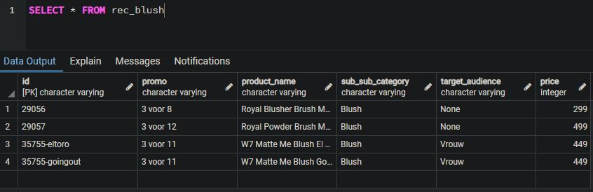
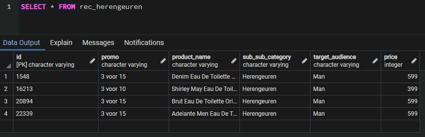

###### * This project is for educational purposes only.

# Recommendation engine:
The goal of this project is to create an algorithm that creates new tables for the respective content pages and fills these with the four most relevant records based on the next filtering choices:

## Content filtering:
A filter based on sub_sub_category and if the product has a promo. Every sub_sub_category gets its own recommendation table named 'rec_<sub_sub_category name>' Each of these tables contains 4 records (if there are as many) based on their sub_sub_category and IF they have a promo. So there may be some cases in which there are less records.

Two result tables:

## Collaborative filtering:
A filter based on similar people.