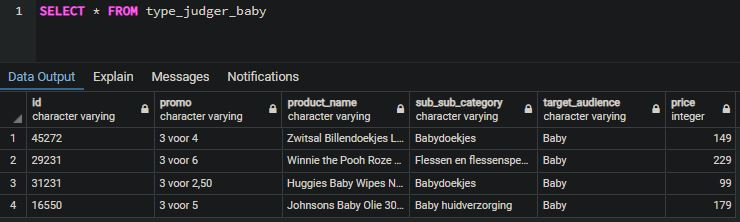
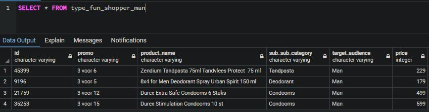

###### * This project is for educational purposes only.

# Recommendation engine:
The goal of this project is to create an algorithm that creates new tables for the respective content pages and fills these with the 4 most relevant records based on the next filtering choices:

## Content filtering:
A filter based on sub_sub_category and if the product has a promo. Every sub_sub_category gets its own recommendation table named 'rec_<sub_sub_category name>'. Each of these tables contains 4 records (if there are as many) based on their sub_sub_category and IF they have a promo. So there may be some cases in which there are less records.

Two result tables:

## Collaborative filtering:
A filter based on similar people.

There are different 'personality types' based on a combination of segment and genders, "None" segments not included.
Each personality type has its own recommendation table, consisting of 4 products.
These products are all put together from the same combination and IF the products have a promo.

Two result tables:

